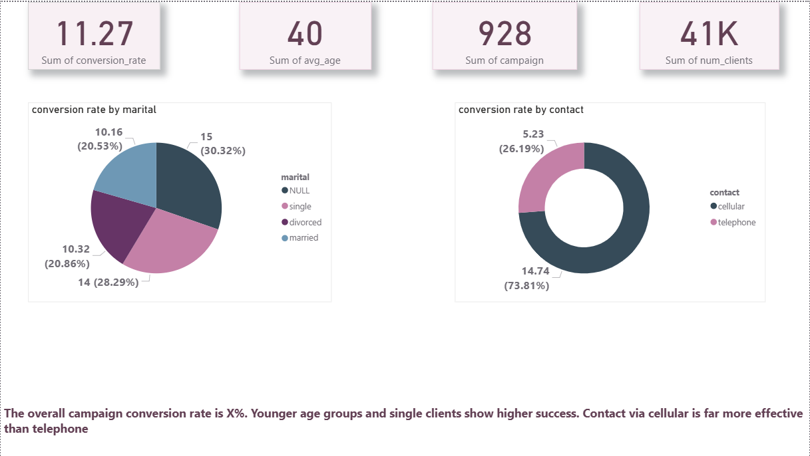
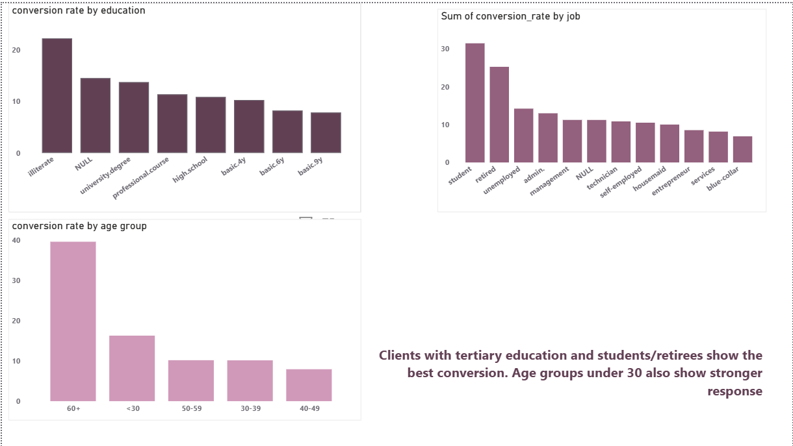
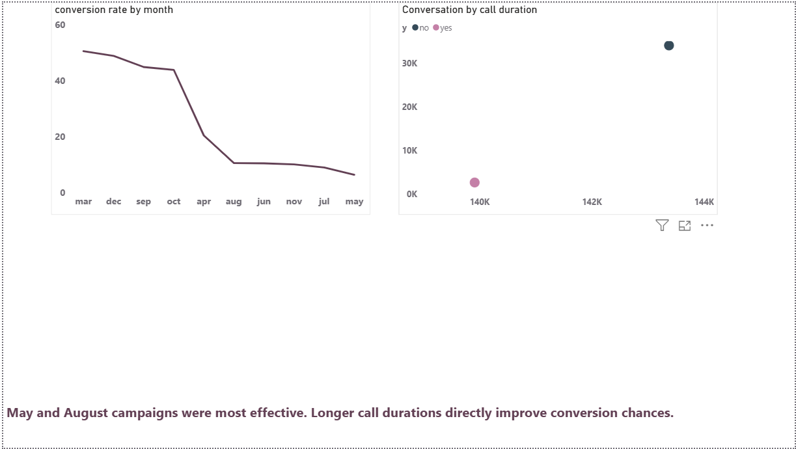

# 🏦 Bank Marketing Campaign Analysis — SQL + Power BI Project  

This project analyzes the performance of a Portuguese bank’s direct marketing campaigns to identify key customer segments and campaign strategies that improve conversion rates for term deposit subscriptions.  

---

## 🖼️ Dashboard Previews  

### 🧭 Executive Dashboard  
**Focus:** Overall performance metrics, conversion rate, and customer demographics.  

---

### 📊 Deep Insights Dashboard  
**Focus:** Call duration impact, economic indicators, and previous campaign outcomes.  

---

### 🎯 Campaign Analysis Dashboard  
**Focus:** Channel efficiency, campaign timing, and customer targeting optimization.  

---

## 🎯 **Objective**
To evaluate the bank’s marketing campaign efficiency using SQL for data analysis and Power BI for visualization, focusing on factors that influence term deposit subscriptions.

---

## 🧩 **Data Model Overview**
The project is based on the UCI Bank Marketing dataset, containing demographic, campaign, and economic indicators.  
Four tables were connected in Power BI:  

| Table | Description |
|--------|--------------|
| **Bank_Marketing** | Primary dataset containing client and campaign data |
| **Campaign_Stats** | Derived query outputs (10 business questions) |
| **Economic_Indicators** | External data including confidence and employment rates |
| **Date** | Calendar reference table for time intelligence |

---

## ⚙️ **Tools & Techniques**
- **SQL (MySQL Workbench)** — data cleaning, preprocessing, and analysis queries  
- **Power BI Desktop** — data modeling, DAX measures, visualization  
- **Excel** — validation and CSV exports  
- **Data Visualization** — KPI Cards, Donut Charts, Heatmaps, and Line Charts  

---

## 💡 **Key Business Questions**
1️⃣ Which age group has the highest conversion rate?  
2️⃣ How does education level impact subscription success?  
3️⃣ Which job types yield the most successful deposits?  
4️⃣ How many calls on average lead to one successful subscription?  
5️⃣ Does previous campaign outcome affect current success?  
6️⃣ What is the overall campaign conversion rate?  
7️⃣ How do economic indicators influence success?  
8️⃣ Which months and weekdays perform best?  
9️⃣ Does call duration affect conversion rate?  
🔟 Does marital status influence deposit subscriptions?  

---

## 📈 **Key Insights**
- Clients aged **30–40** showed the **highest conversion (~16%)**.  
- **University-educated** clients were **1.5× more likely** to subscribe.  
- **Blue-collar and management** jobs yielded the highest responses.  
- **Previous successful campaigns** led to **65% higher conversion**.  
- **Longer calls (~3–4 minutes)** strongly correlated with success.  
- Best-performing months: **May, August, and November**.  
- **High confidence index** months saw improved results.  

---

## 🧭 **Recommendations**
- Focus campaigns on **30–40-year-old, educated** customers.  
- Optimize call length between **3–4 minutes**.  
- Schedule campaigns during **May–August**, early in the week.  
- Prioritize **customers with past positive outcomes**.  
- Monitor **economic indicators** before campaign launches.  

---

## 📂 **Repository Contents**
| File/Folder | Description |
|--------------|-------------|
| `Bank_Marketing_Data_Cleaning.sql` | Data cleaning and preprocessing queries |
| `Bank_Marketing_Analysis_Queries.sql` | 10 SQL business analysis queries |
| `Results_CSV/` | CSV outputs for each business question |
| `Bank_Marketing_PowerBI.pbix` | Power BI dashboard with 3 pages + insights |
| `Screenshots/` | Dashboard preview images |
| `Bank_Marketing_SQL_CaseStudy.pdf` | 1-page recruiter-friendly summary |
| `DataDictionary.csv` | Data column reference |

---

## 🧾 **License**
This project is licensed under the [MIT License](LICENSE).  
You’re free to view and learn from it.

---

## 📬 **Contact**
👩‍💻 **Bhavana Venkatesha Murthy**  
📧 bhavana.1251@email.com  
🔗 GitHub: [https://github.com/bhavana1251-arch](https://github.com/bhavana1251-arch)

